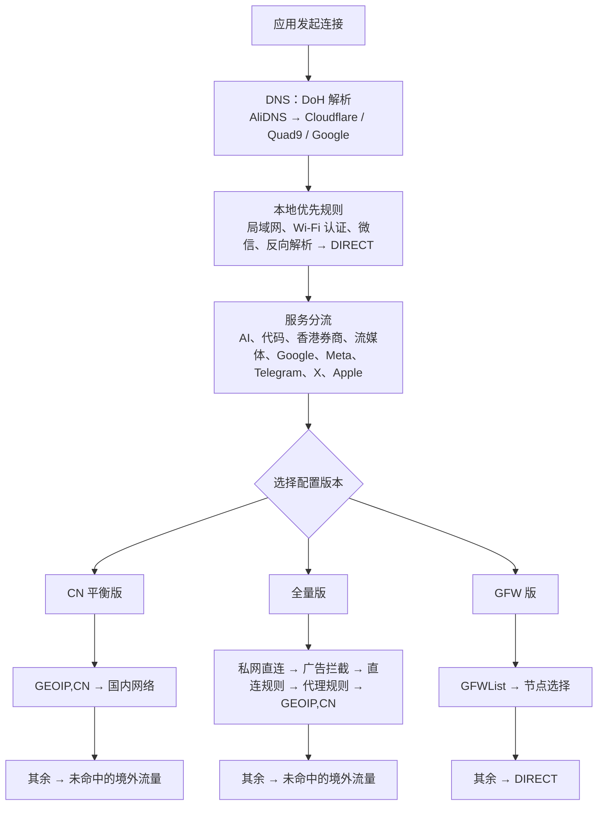

<div align="center">

# ianzo Rule

**为 Shadowrocket 准备的简洁、可更新的分流配置。**

国内直连，境外服务按规则选择出口。没有节点、订阅地址或账号信息。

`CN 平衡版` &nbsp;·&nbsp; `全量版` &nbsp;·&nbsp; `GFW 版`

</div>

<br>

## 选择你的配置

|  | CN 平衡版 · 推荐 | 全量版 | GFW 版 |
| :--- | :--- | :--- | :--- |
| **适合谁** | 希望导入后直接使用的大多数人 | 需要更多直连、代理、广告规则 | 只想代理 GFWList 命中的网站 |
| **默认结果** | 国内直连，其余流量按服务分流后代理 | 完整规则集处理后再兜底 | GFWList 命中代理，其余直连 |
| **本地规则 / 远程规则集** | 34 条 / 18 个 | 38 条 / 22 个 | 34 条 / 19 个 |

<br>

### CN 平衡版 · 推荐

日常最省心的选择。国内网络直连；AI、Google、流媒体、社交等服务由各自策略组处理。

```text
https://raw.githubusercontent.com/ianzo0/Shadowrocket-Rule/main/ianzo-cn.conf
```


<br>

### 全量版

增加私网、广告、直连、代理等上游规则集。规则更多，首次导入、更新编译与内存占用也相应更高。

```text
https://raw.githubusercontent.com/ianzo0/Shadowrocket-Rule/main/ianzo-full.conf
```


<br>

### GFW 版

服务规则优先；其后仅将 GFWList 命中项交给“节点选择”，其余流量保持直连。

```text
https://raw.githubusercontent.com/ianzo0/Shadowrocket-Rule/main/ianzo-gfw.conf
```


<br>

## 三步开始

1. 复制上方地址，或使用 Shadowrocket 扫描对应二维码。
2. 在 Shadowrocket 中选择“从 URL 下载配置”并导入。
3. 默认即可使用；如需指定地区或固定出口，在对应策略组选择单一节点。

每个文件都预置了自己的 `update-url`。之后在 Shadowrocket 中检查更新即可，无需重新找链接。

> [!IMPORTANT]
> AI、Google、Meta 与香港券商的“地区组”并不等于固定公网 IP。对 IP 极为敏感的服务，请在 Shadowrocket 中手动选择并长期使用一条具体节点。

## 默认体验

| 场景 | 默认处理 |
| --- | --- |
| 局域网、公共 Wi‑Fi 认证、微信本地回调 | 直连 |
| Apple 消息推送 | 直连，独立于一般 Apple 服务 |
| 国内网络 | 直连 |
| AI、代码服务、Google、流媒体、TikTok、Meta、Telegram、X | 由独立策略组分流；默认跟随“节点选择”自动测速 |
| 香港券商 | 默认香港节点；请按服务要求固定单一出口 |
| 未命中流量 | CN / 全量版走“未命中的境外流量”；GFW 版直连 |

## 规则如何工作

规则按 `[Rule]` 内从上到下的顺序匹配，命中第一条后不再继续。服务分流优先于各版本的通用兜底规则。



<details>
<summary><strong>网络、DNS 与 Fake‑IP 说明</strong></summary>

配置使用 AliDNS DoH，并以 Cloudflare、Quad9、Google DoH 作为回退；默认关闭 IPv6。`always-real-ip` 将局域网、公共 Wi‑Fi 认证、微信本地回调和 Apple 推送排除在 Fake‑IP 影响之外。不同网络、节点协议和 iOS 版本仍可能表现不同，建议先在自己的设备上验证。

</details>

<details>
<summary><strong>Google 重写与 HTTPS 解密</strong></summary>

配置将 `g.cn`、`google.cn` 重定向至 `www.google.com`。HTTPS 重写需要在 Shadowrocket 生成、安装并在 iOS 设置中信任 CA 证书。MITM 范围只包含这两个域名及其子域；不需要此功能时，可删除或注释 `[URL Rewrite]` 与 `[MITM]` 段。

</details>

## 项目原则

- 不提供代理节点、订阅服务或网络访问保证。
- 不包含节点、账号、订阅地址、密码或证书。
- 配置负责策略与顺序；服务域名/IP 数据以第三方 Shadowrocket 专用规则集远程引用。
- 远程规则会随上游更新，因此其动态条数不作为固定承诺；全量版审计时引用的四份通用清单合计约 30.9 万条。

规则来源、许可证和更新边界请查看 [来源说明](docs/SOURCES.md)；完整审计记录请查看 [审计报告](docs/AUDIT.md)。

<br>

---

<div align="center">
  本仓库原创内容采用 <a href="LICENSE">MIT License</a>。请自行确认节点来源、当地法律和各服务使用条款。
</div>
