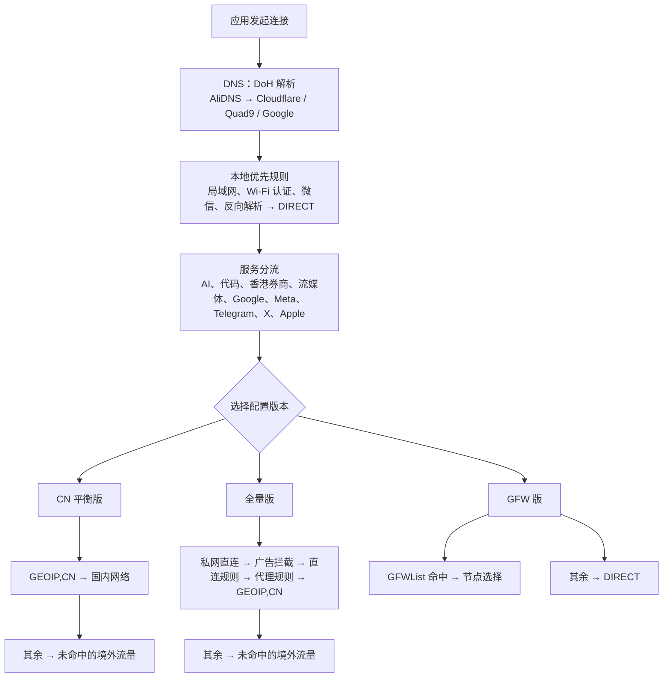

# ianzo Shadowrocket Rule

一个面向 Shadowrocket 的独立配置项目。

当前版本是 `0.1.2`，已包含局域网、公共 Wi-Fi 认证、微信直连、加密 DNS、AI、代码服务 GitHub/GitLab、Google、流媒体 Netflix/Disney+、TikTok、Meta（Facebook/Instagram）、Telegram 电报、X 推特、苹果消息推送、Apple 服务、香港券商和中国大陆 IP 的基础分流；服务规则以第三方 Shadowrocket 专用规则集远程引用。首次导入时，通用服务默认通过“节点选择 → 自动选择”运行，地区策略组保留为按需手动切换出口的选项。

## 目标

- 不包含节点、账号、订阅地址、密码或证书；
- 通过香港、美国、日本、台湾、新加坡、其他节点和服务类型进行可手动切换的分流；
- 兼顾 DNS 隐私、网络可用性和移动设备性能；
- 使用固定文件名，便于后续通过 GitHub 远程更新。

## 当前规则边界

本项目将“策略组和规则顺序”与“规则数据”分开维护：配置定义分流策略，服务域名/IP 数据通过第三方 Shadowrocket 专用规则集远程引用。规则来源、用途和边界记录在 `docs/SOURCES.md`。香港券商引用 `HK_Broker.list`，默认使用“香港节点”；为减少出口 IP 变化，请按券商要求在客户端选择并长期使用稳定的单一节点。本项目不提供投资建议，也不保证各金融服务的地区可用性或风控结果。QUIC 阻止功能默认关闭，以避免影响 HY2、TUIC 等 UDP 节点。

地区节点组依赖节点名称中的国旗、国家缩写或城市关键词；如果订阅名称不符合这些关键词，对应地区组可能为空。AI、Google、Meta 和香港券商的地区选择也不等于固定公网 IP；需要固定出口时，应在 Shadowrocket 中选择具体节点。

配置增加了 `always-real-ip` 排除项，让局域网、公共 Wi-Fi 认证、微信本地回调和 Apple 推送使用真实 IP，降低 TUN/Fake-IP 对系统服务的影响；仍需在 iPhone 实机验证。

苹果消息推送默认直连，并独立于一般 Apple 服务。若推送延迟或无法送达，可在 Shadowrocket 中仅切换“苹果消息推送”策略组，无需改变 iCloud、App Store 等 Apple 服务的出口。

## Google 重写与 HTTPS 解密

配置会将 `g.cn`、`google.cn` 重定向到 `www.google.com`。由于 HTTPS 请求需要解密才能重写，使用前必须在 Shadowrocket 生成、安装并在 iOS 设置中信任其 CA 证书。MITM 范围严格限制为 `g.cn` 和 `google.cn` 的根域及子域；不希望解密这部分流量的用户应删除或注释 `[URL Rewrite]` 与 `[MITM]` 两个段落。

## 项目结构

```text
Shadowrocket-Rule/
├── ianzo-rule-cn.conf    ← 平衡版：国内直连、其他流量按服务分流后代理
├── ianzo-rule-full.conf  ← 全量规则版：加入远程直连、代理、广告与私网规则集
├── ianzo-rule-gfw.conf   ← GFW 模式：服务分流 → GFWList 代理 → 其余直连
├── README.md
├── LICENSE
├── CHANGELOG.md
├── docs/
│   └── AUDIT.md
│   └── SOURCES.md
├── rules/
└── .github/
    └── workflows/
        └── validate.yml
```

## 配置版本

| 文件 | 适用场景 | 最终策略 |
| --- | --- | --- |
| `ianzo-rule-cn.conf` | 大多数用户 | 中国大陆 IP 直连，其余流量交由“未命中的境外流量”策略组处理。 |
| `ianzo-rule-full.conf` | 希望获得更多直连/代理/广告覆盖的用户 | 服务分流后使用外部全量规则集，再以中国大陆 IP 与未命中流量兜底；规则规模较大。 |
| `ianzo-rule-gfw.conf` | 偏好白名单直连、只代理受限网站的用户 | 服务分流后命中 GFWList 才代理，其他全部直连。 |

## 规则处理流程

三套配置均从 DNS 解析和本地直连规则开始；随后按 `[Rule]` 中自上而下的顺序匹配，命中第一条规则后即停止继续匹配。服务分流优先于各版本的通用兜底规则。



例如，打开 ChatGPT 时会先命中 OpenAI 规则，再交由“🤖 AI服务 OpenAI/Anthropic”策略组选择出口；不会继续匹配广告、国内 IP 或最终兜底规则。

全量版会加载约 30.9 万条上游规则，可能增加首次导入、更新编译和内存占用；低性能设备可优先使用 CN 平衡版。

## 使用说明

使用 `ianzo-rule-cn.conf` 的 Raw 地址导入 Shadowrocket；配置内已写入同一更新地址，后续可在 Shadowrocket 中直接检查更新。

主配置更新地址：

```text
https://raw.githubusercontent.com/ianzo0/Shadowrocket-Rule/main/ianzo-rule-cn.conf
```

本项目不提供代理节点、订阅服务或网络访问保证。用户应自行确认节点来源、当地法律和各服务的使用条款。

## 许可与第三方依赖

本仓库中的原创内容采用 MIT License。后续引用的第三方规则会在配置和文档中单独标注来源、许可证及更新时间；第三方规则不会被默认视为本项目原创内容。
